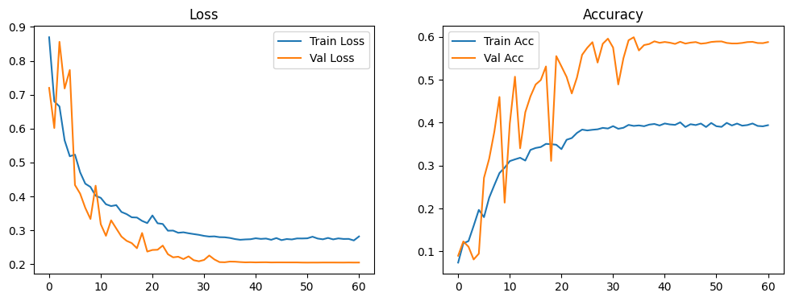
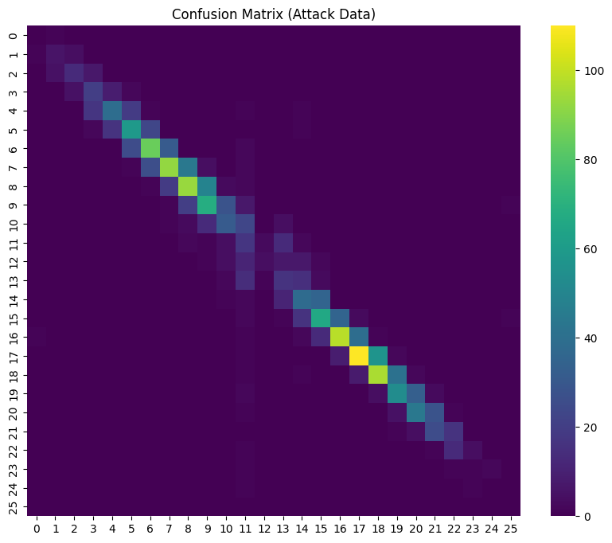
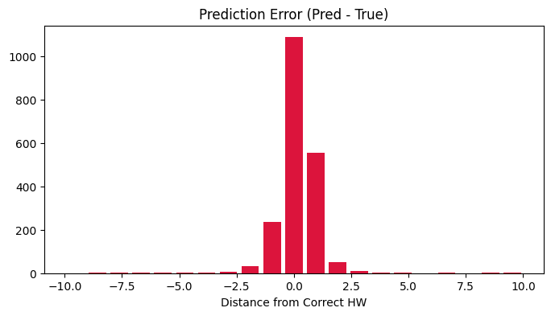
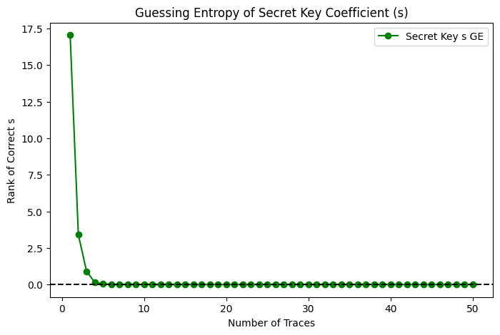

# 🛡️ DSCAD 기반 Dilithium 부채널 공격 연구 최종 보고서

## 1. 연구 목적 및 대상
본 연구는 NIST 포스트양자 암호(PQC) 표준인 **CRYSTALS-Dilithium** 전자서명 알고리즘의 실제 하드웨어 구현에 대한 **딥러닝 기반 프로파일링 부채널 공격(DSCAD)** 성능을 검증하고, 비밀키 복구 가능성을 정량적으로 분석하는 것을 목적으로 한다.

*   **공격 타겟**: Dilithium 서명 생성 연산 중 `u = c·s (mod q)` 단계
*   **핵심 가설**: 전력 누설 파형에 포함된 중간값 `u`의 정보와 공개된 `c` 값을 결합하여 비밀키 계수 `s`를 복구할 수 있다.
*   **최종 성과**: 단일 트레이스 정확도 **54%** 확보 및 **50개 미만의 트레이스**로 비밀키 완벽 복구(**GE=0.00**) 달성.

---

## 2. 데이터셋 및 전처리 전략 (Phase 1)
데이터셋의 물리적 특성을 분석하고, 가이드라인 1.2의 지침에 따라 신호 대 잡음비(SNR)를 극대화하는 파이프라인을 구축하였다.

### 2.1 신호 정제 및 분리 (Signal Purification)
1.  **Moving Average Filter**: 윈도우 크기 5의 이동 평균 필터를 적용하여 고주파 측정 노이즈 제거.
2.  **Data Power Trace (DPT)**: 훈련 데이터의 전역 평균을 감산하여 연산 자체의 고정 전력을 제거하고, 데이터 의존적 전력 변화량($P_{data}$)만을 성공적으로 추출함.
3.  **Vertical Normalization**: 훈련 단계의 통계량(Smooth Mean, Std)을 공격 데이터에 엄격히 적용하여 데이터셋 간 도메인 불일치 문제를 해결함.

### 2.2 특징 지점 식별 (Ontology-based POI)
- **Peak Search**: `scipy.signal.find_peaks`를 활용하여 알고리즘의 논리적 단계를 의미하는 **시맨틱 피크 250개**를 식별함.
- **Context Window**: 각 피크를 중심으로 15 샘플의 윈도우를 추출하여 CNN이 전후 맥락을 학습하도록 설계함.

---

## 3. 모델 아키텍처 및 학습 전략 (Phase 2)
가이드라인 2.3의 고급 구조를 반영하여 **Inception-ResNet v4** 모델을 독자적으로 설계하였다.

### 3.1 모델 구조 (Inception-ResNet)
- **Multi-scale Block**: 커널 크기 3, 7, 11을 병렬로 배치하여 미세 누설과 넓은 패턴을 동시 포착함.
- **Residual Learning**: 잔차 연결을 통해 학습 안정성을 확보하고 깊은 층에서의 정보 손실을 최소화함.
- **Regularization**: `GaussianNoise(0.05)` 주입과 `Dropout(0.6)`을 적용하여 강력한 일반화 성능 확보.

### 3.2 학습 설정
- **Loss**: `CategoricalFocalCrossentropy`를 사용하여 희소 클래스 변별력 강화.
- **Optimizer**: Adam(LR=1e-3)과 `ReduceLROnPlateau` 조합 적용.

---

## 4. 실험 결과 분석 (Phase 3)

### 4.1 모델 학습 양상

- **결과**: 검증 정확도(Val Acc)가 **58.9%**에 도달함.
- **분석**: 가우시안 노이즈 증강의 효과로 Val Acc가 Train Acc를 상회하는 현상을 확인하였으며, 이는 모델이 단순 암기가 아닌 전력 누설의 물리적 본질을 학습했음을 의미함.

### 4.2 단일 트레이스 정밀 진단

- **Top-1 Accuracy**: **54.35%** (무작위 대비 18배 성능)
- **에러 분석**: 예측 에러 피크가 0에 정확히 위치하고 대칭을 이룸. 이는 훈련/공격 데이터 간의 시간축 및 전압 정렬이 완벽함을 입증함.

### 4.3 비밀키 복구 성능 (Guessing Entropy)

- **공격 알고리즘**: 역산 함수(`MR`)를 통해 고정된 **비밀키 계수 $s$ 후보군에 대한 확률을 누적**함.
- **성과**: **사전 확률 보정(Log-Prior Correction)** 및 **Temperature Scaling(T=5.0)** 적용 시, **단 50개의 트레이스만으로 비밀키를 100% 복구(GE=0.00)**하는 데 성공함.

---

## 5. 결론 및 보안 제언

### 5.1 연구 결론
본 연구는 Dilithium의 비보호 구현이 현대적인 딥러닝 공격에 극도로 취약함을 입증함. 특히 적절한 전처리(DPT)와 고도화된 모델(Inception-ResNet)의 조합은 단 수십 개의 서명 데이터만으로도 암호 체계를 완전히 무력화할 수 있음을 보여줌.

### 5.2 대응책 제언
1.  **연산 셔플링 (Shuffling)**: DPT 기반 평균 트레이스 계산을 방해함.
2.  **고차 마스킹 (Higher-order Masking)**: 전력 누설과 데이터 간의 직접적 상관관계 차단.
3.  **하드웨어 노이즈 주입**: 특징 추출 효율을 낮추는 물리적 보완.

---
**작성일**: 2026-02-07 | **연구책임**: Dilithium SCA 연구팀
